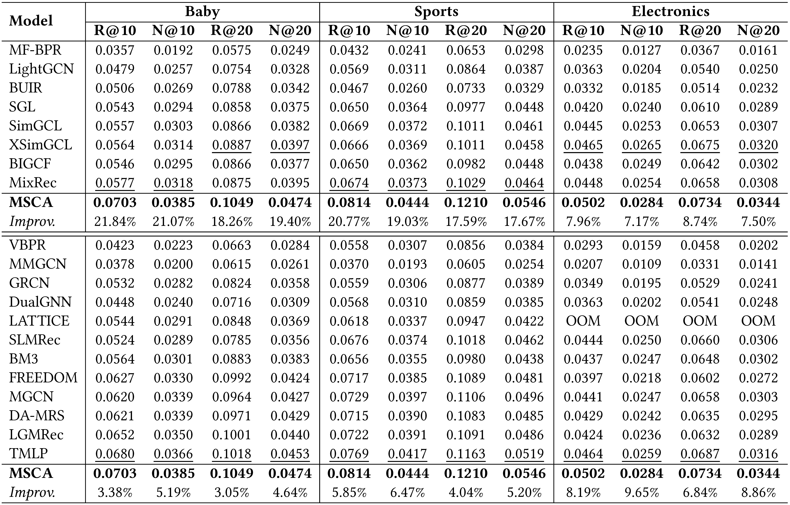

# Second-paper

Clean reproducible source repository for the second multimodal recommendation paper.

## Current phase

This repository is bootstrapped from the official **MSCA (WWW 2026)** implementation and keeps the MMRec-style training/evaluation structure.

- Frozen upstream: `recomall/MSCA`
- Frozen upstream commit: `48455de8efa943e16d49db665e7f2fcb0c6c5e17`
- Phase 0 scope: vanilla MSCA baseline and Phase 1 preparation only
- Planned research extensions: **CoLiftRec** and **Condition-Adaptive Diffusion Semantic Purification**
- CoLiftRec and Diffusion are intentionally **not** integrated in Phase 0.

The upstream `LICENSE` is retained unchanged. See `PROVENANCE.md` for the exact import provenance and reproducibility rules.

## Reproducibility policy

The final pipeline must train from the current run. Historical MSCA/DiCalRec checkpoints, old Top100 caches, old diffusion checkpoints, purified features, and ranking caches are not runtime dependencies.

Canonical datasets and multimodal features are placed under `data/<dataset>/` locally and are intentionally excluded from Git.

---

## Upstream MSCA README

# MSCA (WWW'26)
PyTorch implementation for MSCA proposed in the following paper:
 >**Multi-view Semantic Contrastive Alignment for Multimodal Recommendation**  
 >Jiuqiang Li, Hongjun Wang*  
 >In *WWW 2026*  
 >[Paper](https://doi.org/10.1145/3774904.3792192)

## Overview
<p>

</p>

## News

- **[2026-07]** **MSCA** has been integrated into the [MMRec](https://github.com/enoche/MMRec) framework.
- **[2026-05]** **MSCA** has been integrated into the [MRLib](https://github.com/Jinfeng-Xu/Multimodal-Recommendation-Library) framework.
- **[2026-04]** The source code for **MSCA** has been publicly released.

## Environment
- Python 3.8.10
- PyTorch 1.11.0+cu113

For dependency details, refer to `requirements.txt`.

## Dataset
Download from Google Drive: [Baby/Sports/Electronics](https://drive.google.com/drive/folders/13cBy1EA_saTUuXxVllKgtfci2A09jyaG) ([Raw Data](http://jmcauley.ucsd.edu/data/amazon/links.html)). The data includes image and text features provided by the [MMRec](https://github.com/enoche/MMRec) framework, extracted from VGG and Sentence-Transformers. Preprocessing from raw data can be found [here](https://github.com/enoche/MMRec/tree/master/preprocessing).

Download a supplementary dataset for micro-video recommendation: [MicroLens](https://drive.google.com/drive/folders/14UyTAh_YyDV8vzXteBJiy9jv8TBDK43w) ([Raw Data](https://github.com/westlake-repl/MicroLens)) within MMRec.

## Training and Evaluation
1. Download the datasets and place them in the `data` folder. 

2. Set the hyperparameters in the `src/configs/model/MSCA.yaml` file.

3. Run:
```bash
cd ./src
python main.py -m MSCA -d {dataset_name}
```

4. Test:
```bash
python test.py -m MSCA -d {dataset_name} -c {checkpoint_path}
```

## Performance Comparison
<p>

</p>

## Reproducibility
We report the best hyperparameters of MSCA to reproduce the results in Table 2 and 6 of our paper.

<table>
  <tr>
    <th>Dataset</th>
    <th>n_layers</th>
    <th>fusion_coeff</th>
    <th>cl_weight</th>
    <th>reg_weight</th>
  </tr>
  <tr>
    <td>Baby</td>
    <td>2</td>
    <td>0.4</td>
    <td>0.005</td>
    <td>3e-7</td>
  </tr>
  <tr>
    <td>Sports</td>
    <td>3</td>
    <td>0.3</td>
    <td>0.005</td>
    <td>5e-8</td>
  </tr>
  <tr>
    <td>Electronics</td>
    <td>4</td>
    <td>0.2</td>
    <td>0.01</td>
    <td>5e-10</td>
  </tr>
  <tr>
    <td>MicroLens</td>
    <td>4</td>
    <td>0.3</td>
    <td>0.01</td>
    <td>5e-9</td>
  </tr>
</table>

The training logs and model checkpoints are provided below:

<table>
  <tr>
    <th>Dataset</th>
    <th colspan="2">Download</th>
  </tr>
  <tr>
    <td>Baby</td>
    <td><a href="https://drive.google.com/file/d/1WtWTMF9nO80kU-6YOHYl6fRk55HnH3FU/view">log</a></td>
    <td><a href="https://drive.google.com/file/d/1_fviSt_RP38jfcRH6vUcepYn5sBzOZq-/view">checkpoint</a></td>
  </tr>
  <tr>
    <td>Sports</td>
    <td><a href="https://drive.google.com/file/d/1xVXi5_E4gONSk-KfFB5l4i95b1jRoXtd/view">log</a></td>
    <td><a href="https://drive.google.com/file/d/1lUNDySGAEVa8kVYV289fxt73Z5nLNDqK/view">checkpoint</a></td>
  </tr>
  <tr>
    <td>Electronics</td>
    <td><a href="https://drive.google.com/file/d/1Q_FEPxDdHRdsS22tI-N9vJxmA56BUjF8/view">log</a></td>
    <td><a href="https://drive.google.com/file/d/1IeSiSCltNVHZoOKMrc7aFj6QHRg721s-/view">checkpoint</a></td>
  </tr>
  <tr>
    <td>MicroLens</td>
    <td><a href="https://drive.google.com/file/d/1Nzmg_-OWgheSiF2D6QTHncL13glUBvwg/view">log</a></td>
    <td><a href="https://drive.google.com/file/d/1AUku-hkoigFMx0oaTSYQELwCS5o3-QC_/view">checkpoint</a></td>
  </tr>
</table>

## Citation
If you find MSCA helpful to your research, please consider citing the following paper.
```bibtex
@inproceedings{li2026multi,
  title={Multi-view Semantic Contrastive Alignment for Multimodal Recommendation},
  author={Li, Jiuqiang and Wang, Hongjun},
  booktitle={Proceedings of the ACM Web Conference 2026},
  pages={5941--5952},
  year={2026}
}
```

Licensed under the GNU GPL v3.0. See [LICENSE](LICENSE).

## Acknowledgement
​​This repository is based on [MMRec](https://github.com/enoche/MMRec). Thanks for their work.